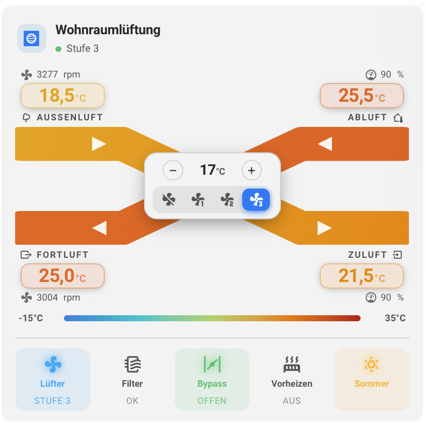
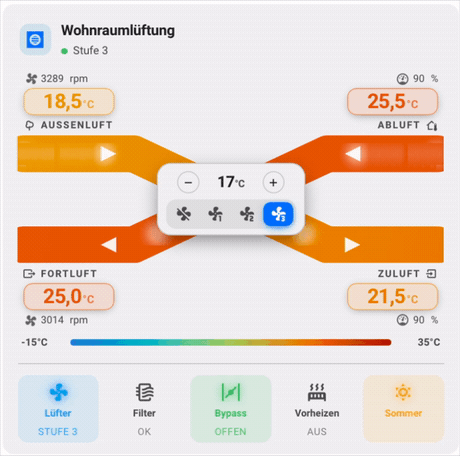
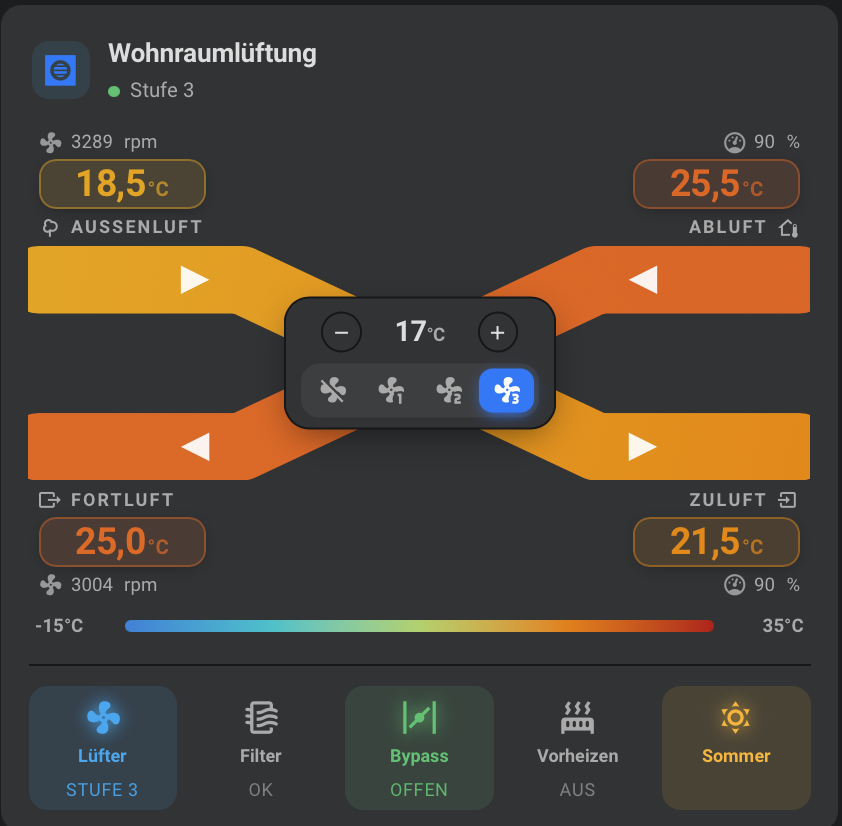
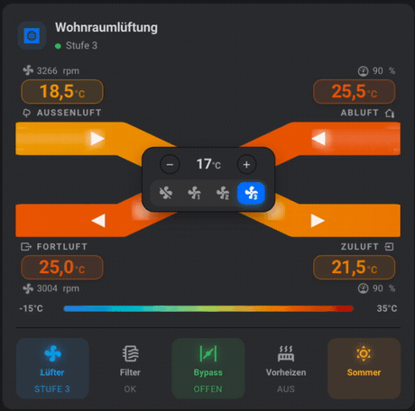

# Home Assistant Lovelace ComfoAir Card

Use [esphome-comfoair](https://github.com/wichers/esphome-comfoair) to connect your ComfoAir to Home Assistant, then use this Lovelace card to visualize and control it.

Visualization inspired by [TimWeyand/lovelace-comfoair](https://github.com/TimWeyand/lovelace-comfoair) (crossed airflows, temperature color scale, setpoint/fan controls, status chips) — English UI, entity IDs for **esphome-comfoair**.

[](https://my.home-assistant.io/redirect/hacs_repository/?owner=wichers&repository=lovelace-comfoair)

## Features

- Crossed airflows (outside / extract / exhaust / supply) with a **fixed temperature color scale** (OKLCH: dark blue ≤ −20 °C → red ≥ 40 °C)
- **Heat recovery %** computed from the four temperatures (hidden when bypass is open)
- Setpoint (− / +) and fan modes (Off / Low / Medium / High)
- Status row: Fan, Filter, **Error**, Bypass, Preheat, Summer/Winter
- **Filter / error reset**: click an active Filter or Error chip to confirm and press the matching HA button
- Optional **service / test mode** dialog (`enable_test_mode`, default off)
- Optional **animated** airflows and spinning fans
- Optional temperature **legend**
- Click a temperature / rpm / % value to open Home Assistant more-info history
- **Auto-detected entity prefix** from the climate entity (device siblings / object_id heuristics); optional `prefix` override
- **Visual card editor** in the dashboard UI (climate picker, animation/colors, advanced entity overrides)
- Missing entities are listed instead of throwing in the browser console


## Gallery

Screenshots from the TimWeyand visualization this card adopts (light/dark, static/animated):

| | Static | Animated |
|---|---|---|
| **Light** |  |  |
| **Dark** |  |  |

## Installation

### Manual

* Clone this repo into your `www` folder: `config/www/lovelace-comfoair`.
* Register the resource:
```yaml
resources:
  - type: module
    url: /local/lovelace-comfoair/comfoair-card.js
```
* Add the card (see configuration below).
* Hard-refresh the browser (Ctrl+F5) after updating the JS.

### HACS

1. HACS → Custom repositories → add this repository as **Dashboard** / Lovelace.
2. Download **Comfoair ventilation lovelace component**.
3. Resource (usually added automatically):
   ```yaml
   url: /hacsfiles/lovelace-comfoair/comfoair-card.js
   type: module
   ```

## Configuration

### UI editor

1. Edit dashboard → **Add card** → search for **ComfoAir Card** (or paste the YAML below).
2. Pick the **climate** entity — the sensor prefix is filled automatically.
3. Adjust animation / color scale as needed.
4. Open **Advanced / entity overrides** only if individual sensors need remapping.

### YAML

Minimal example — only the climate entity is required; the sensor **prefix is auto-detected**:

```yaml
type: custom:comfoair-card
entity: climate.esphome_comfoair200_comfoair_200
# prefix: esphome_comfoair200   # optional override if auto-detect is wrong
```

How prefix auto-detection works:

1. Explicit `prefix` in config (if set)
2. Sibling entities on the same HA **device** as the climate entity
3. Score candidate prefixes derived from the climate object_id against live `sensor.*` states  
   (e.g. `climate.esphome_comfoair200_comfoair_200` → tries `…_comfoair_200`, then `esphome_comfoair200`, …)
4. Fallback `comfoair` (legacy)

| Option | Required | Default | Description |
|--------|----------|---------|-------------|
| `entity` | yes | — | Climate entity of the ComfoAir unit |
| `prefix` | no | *auto* | Prefix for sensor / binary_sensor IDs; auto-derived from the climate entity when omitted |
| `name` | no | `ComfoAir` | Card title |
| `animation` | no | `static` | `static` or `animated` (flow particles + spinning fans) |
| `animation_speed_source` | no | `fixed` | `fixed` (%) or `level` (from supply/return air level) |
| `animation_speed` | no | `50` | Speed when source is `fixed` (10–200; 100 = baseline) |
| `color_scale` | no | `fixed` | `fixed` maps −20…40 °C (dark blue→red); `auto` stretches over current temps |
| `temp_min` | no | `-20` | Lower bound for fixed color scale (°C); at or below → dark blue |
| `temp_max` | no | `40` | Upper bound for fixed color scale (°C); at or above → red |
| `show_legend` | no | `false` | Show temperature color legend |
| `enable_test_mode` | no | `false` | Show header button that opens the service/test dialog |

### Entity IDs

With `prefix: esphome_comfoair200` the card expects:

| Role | Entity |
|------|--------|
| Outside temp | `sensor.{prefix}_outside_air_temperature` |
| Exhaust temp | `sensor.{prefix}_exhaust_air_temperature` |
| Extract / return temp | `sensor.{prefix}_return_air_temperature` |
| Supply temp | `sensor.{prefix}_supply_air_temperature` |
| Intake fan RPM | `sensor.{prefix}_intake_fan_speed_rpm` |
| Exhaust fan RPM | `sensor.{prefix}_exhaust_fan_speed_rpm` |
| Return air level | `sensor.{prefix}_return_air_level` |
| Supply air level | `sensor.{prefix}_supply_air_level` |
| Filter | `sensor.{prefix}_filter_status` |
| Errors | `sensor.{prefix}_error_status` |
| Filter reset | `button.{prefix}_filter_reset` |
| Error reset | `button.{prefix}_error_reset` |
| Bypass | `binary_sensor.{prefix}_bypass_valve_open` |
| Preheat | `binary_sensor.{prefix}_preheating_state` |
| Summer mode | `binary_sensor.{prefix}_summer_mode` |

Override any of those with a full entity ID using the same key name, e.g. `outside_air_temperature: sensor.my_temp`. TimWeyand-style aliases (`tempSensor1`…`tempSensor4`, `fan_speed_supply`, `filterstatus`, `bypass_valve`, `preheat`) are also accepted.

### Status chips and resets

The status row shows fan, filter, **error**, bypass, preheat, and season.

- **Filter** chip is active when status is `Full`. Click it to confirm and press `button.{prefix}_filter_reset` (resets the unit’s filter timer).
- **Error** chip shows active fault codes from `error_status` (e.g. `A1, E2`), or `None` when clear. Click when active to confirm and press `button.{prefix}_error_reset`.

Requires esphome-comfoair with `error_status`, `filter_reset`, and `error_reset` configured under `comfoair:`.

### Service / test mode

Both sides are **off by default**:

1. ESPHome: `enable_test_mode: true` under `comfoair:` (auto-creates test entities).
2. Card: `enable_test_mode: true` in the card config (shows a test-tube button in the header).

The dialog can enter/exit PC test mode, start self-test, drive bypass/preheat flaps, set supply/exhaust/post-heat %, and toggle relays/filter LED. Controls that require an active test mode session are dimmed until the master switch is on.

### Example with options

```yaml
type: custom:comfoair-card
entity: climate.esphome_comfoair200_comfoair_200
name: Ventilation
animation: animated
animation_speed_source: level
show_legend: true
# enable_test_mode: true  # optional service dialog
```

## Credits

* Original card: [wichers/lovelace-comfoair](https://github.com/wichers/lovelace-comfoair)
* Visualization design: [TimWeyand/lovelace-comfoair](https://github.com/TimWeyand/lovelace-comfoair)
* ESPHome integration: [wichers/esphome-comfoair](https://github.com/wichers/esphome-comfoair)
